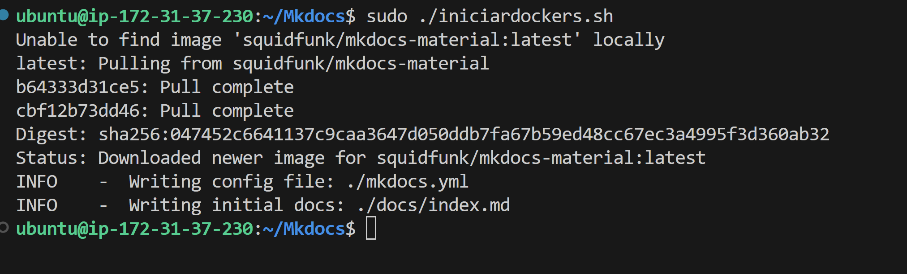
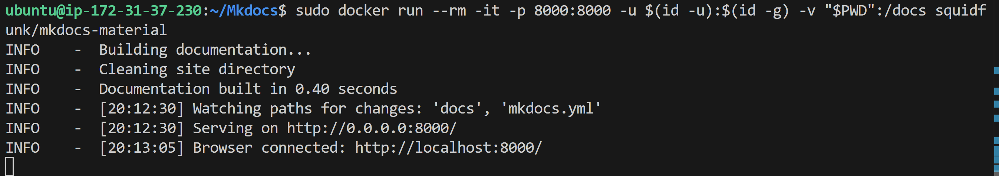
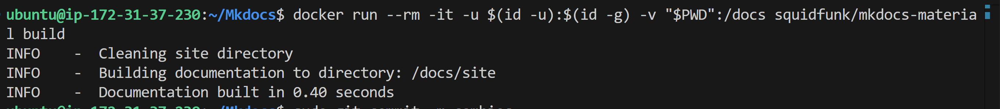
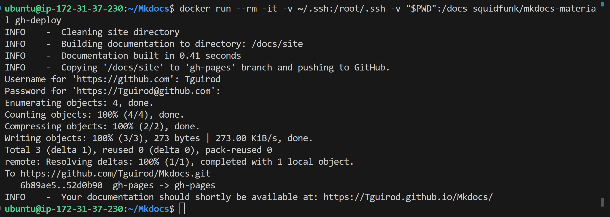
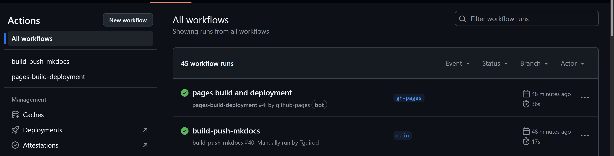
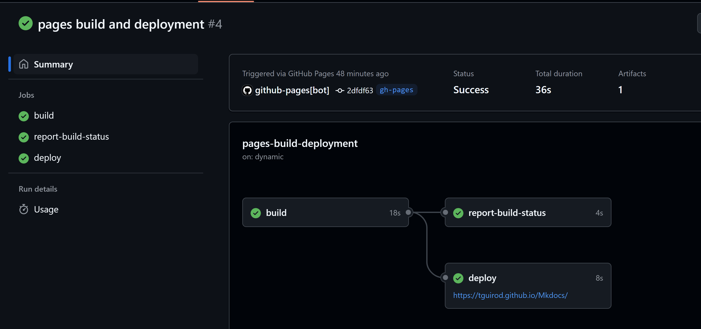
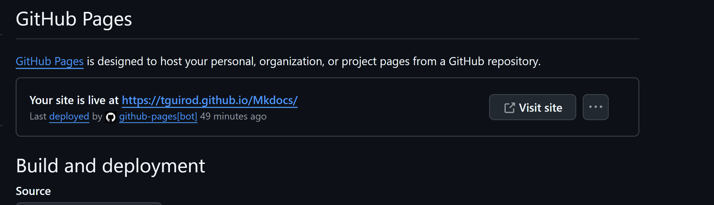
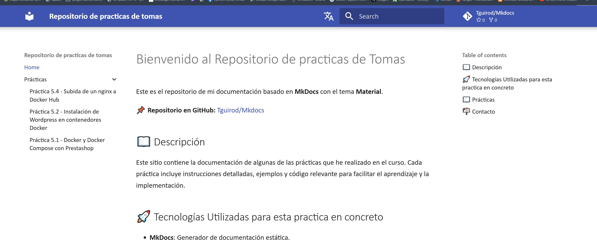
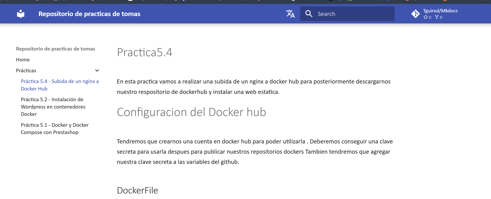

# Mkdocs
En esta practica vamos a trabajar con MkDocs Material para generar una web estatica con github pages y que tengamos ahi nuestros repositorios.

## Instalación

Hacemos un archivo mkdocds.yml:

```YML
site_name: "Repositorio de practicas de tomas"
theme:
  name: "material"
  palette:
    scheme: "dark"  # Cambiar el color (dark, light, slate, etc.)
    primary: "indigo"
    accent: "red"
  font:
    text: "Calibri"
    code: "Fira code" # Cambiar la fuente de letra
  favicon: "assets/favicon.ico"  # Cambiar los iconos
  features:
    - navigation.instant  # Configurar la navegación
    - navigation.tracking
    - navigation.expand
    - search.highlight  # Configurar las búsquedas
    - search.suggest
    - version
    - navigation.footer

extra:
  version:
    provider: mike  # Configurar el versionado de la documentación
  social:
    - icon: fontawesome/brands/github
      link: https://github.com/Tguirod/Mkdocs  # Añadir un repositorio de GitHub
repo_url: "https://github.com/Tguirod/Mkdocs"
repo_name: "Tguirod/Mkdocs"
edit_uri: "edit/main/docs/"

extra:
  alternate:
    - name: "Español"
      link: "/"
      lang: "es"  # Cambiar el idioma

nav:
  - Home: index.md
  - Prácticas:
      - Práctica 5.4 - Subida de un nginx a Docker Hub: practica1.md
      - Práctica 5.2 - Instalación de Wordpress en contenedores Docker: practica2.md
      - Práctica 5.1 - Docker y Docker Compose con Prestashop: practica3.md

copyright: "&copy; 2025 Repositorio de Tomas"  # Añadir el aviso de copyright aquí
```
Tambien tenemos que tirar los comandos de docker para poder instalarlo la build del sitio y desplegarlo:

```
docker run --rm -it -p 8000:8000 -u $(id -u):$(id -g) -v "$PWD":/docs squidfunk/mkdocs-material new .
docker run --rm -it -p 8000:8000 -u $(id -u):$(id -g) -v "$PWD":/docs squidfunk/mkdocs-material
docker run --rm -it -p 8000:8000 --user $(id -u):$(id -g) -v "$PWD":/docs squidfunk/mkdocs-material build
docker run --rm -it -p 8000:8000 --user $(id -u):$(id -g) -v "$PWD":/docs squidfunk/mkdocs-material gh-deploy
```












## Desplegar en GitHUB

Ahora crearemos un workflow para poder desplegarlo:

```
name: build-push-mkdocs

# Eventos que desescandenan el workflow
on:
  push:
    branches: ["main"]

  workflow_dispatch:

# A workflow run is made up of one or more jobs that can run sequentially or in parallel
jobs:

  # Job para crear la documentación de mkdocs
  build:
    # Indicamos que este job se ejecutará en una máquina virtual con la última versión de ubuntu
    runs-on: ubuntu-latest
    
    # Definimos los pasos de este job
    steps:
      - name: Clone repository
        uses: actions/checkout@v4

      - name: Install Python3
        uses: actions/setup-python@v4
        with:
          python-version: 3.x

      - name: Install Mkdocs
        run: |
          pip install mkdocs
          pip install mkdocs-material 

      - name: Build MkDocs
        run: |
          mkdocs build

      - name: Push the documentation in a branch
        uses: s0/git-publish-subdir-action@develop
        env:
          REPO: self
          BRANCH: gh-pages # The branch name where you want to push the assets
          FOLDER: site # The directory where your assets are generated
          GITHUB_TOKEN: ${{ secrets.GITHUB_TOKEN }} # GitHub will automatically add this - you don't need to bother getting a token
          MESSAGE: "Build: ({sha}) {msg}" # The commit message
```
Comprobamos que se realiza todo correctamente:







Comprobamos que funciona la web https://tguirod.github.io/Mkdocs/




