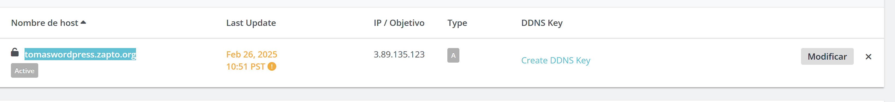
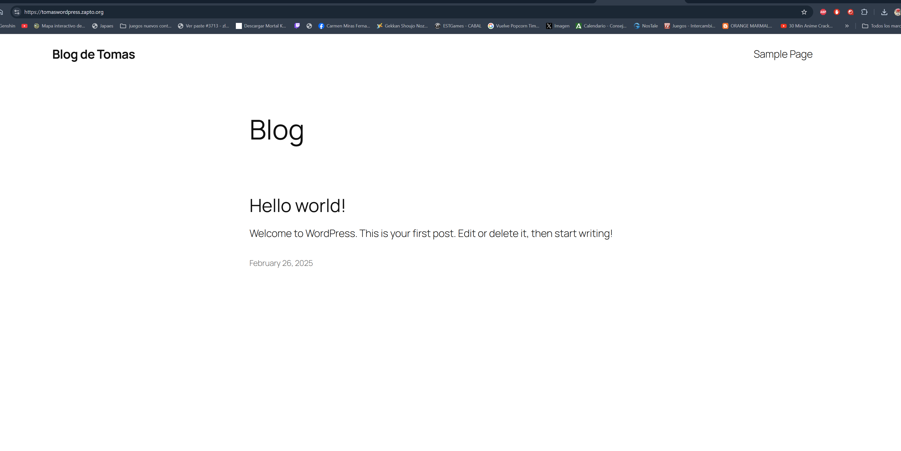
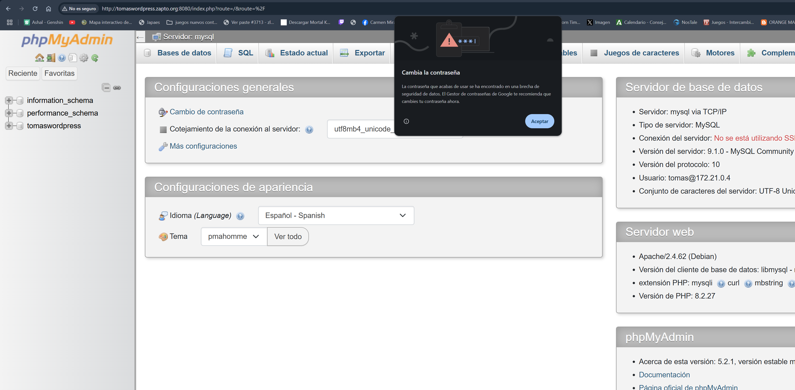

# Practica5.2
En esta practica se realizara la instalacion de wordpress en contenedores dockers.

## Variables y Dominio

Necesitaremos un archivo de variables .env donde tendremos las variables que vamos a utilizar.

Tambien Necesitaremos tambien un dominio para que lets encrypt pueda usarlo




## Instalacion de Wordpress en docker

El archivo YML que utilizaremos contendra la misma informacion que hemos utilizado en la practica anterior pero cambiaremos prestashop por la instalacion de wordpress asi como en el https-portal tendremos que poner el puerto 8080.

```YML
version: '3.4'

services:
  mysql:
    image: mysql:9.1
    ports: 
      - 3306:3306
    environment: 
      - MYSQL_ROOT_PASSWORD=${MYSQL_ROOT_PASSWORD}
      - MYSQL_DATABASE=${MYSQL_DATABASE}
      - MYSQL_USER=${MYSQL_USER}
      - MYSQL_PASSWORD=${MYSQL_PASSWORD}
    volumes: 
      - mysql_data:/var/lib/mysql
    networks: 
      - backend-network
    restart: always
  
  phpmyadmin:
    image: phpmyadmin:5.2.1
    ports:
      - 8080:80
    environment: 
      - PMA_ARBITRARY=1
    networks: 
      - backend-network
      - frontend-network
    restart: always
    depends_on: 
      - mysql
  

  wordpress:
    image: bitnami/wordpress:latest
    container_name: wordpress
    environment:
      - WORDPRESS_DATABASE_HOST=${WORDPRESS_DATABASE_HOST}
      - WORDPRESS_DATABASE_USER=${WORDPRESS_DATABASE_USER}
      - WORDPRESS_DATABASE_PASSWORD=${WORDPRESS_DATABASE_PASSWORD}
      - WORDPRESS_DATABASE_NAME=${WORDPRESS_DATABASE_NAME}
      - WORDPRESS_BLOG_NAME=${WORDPRESS_BLOG_NAME}
      - WORDPRESS_USERNAME=${WORDPRESS_USERNAME}
      - WORDPRESS_EMAIL=${WORDPRESS_EMAIL}
    volumes:
      - wordpress:/var/www/html
    networks:
      - frontend-network
      - backend-network
    restart: always
    depends_on:
      - mysql
  
  https-portal:
    image: steveltn/https-portal:1
    ports:
      - 80:80
      - 443:443
    restart: always
    environment:
      DOMAINS: "${DOMAIN} -> http://wordpress:8080"
      STAGE: 'production' # Don't use production until staging works
      # FORCE_RENEW: 'true'
    networks:
      - frontend-network

volumes:
  mysql_data:
  wordpress:

networks: 
  backend-network:
  frontend-network:
```

## Comprobaciones:


Como podemos comprobar funciona correctamente al entrar en la pagina web de nuestro dominio y con el certificado https




Tambien podemos comprobar que podemos acceder a la web de phpmyadmin


