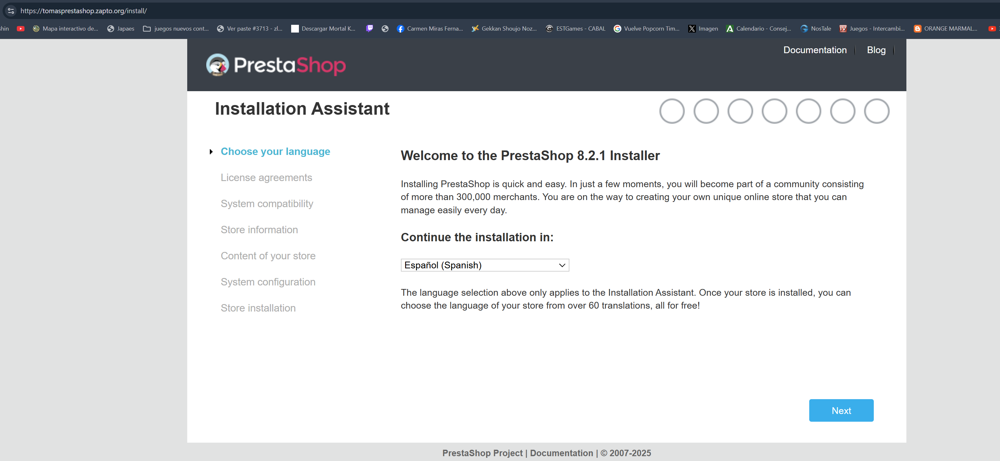
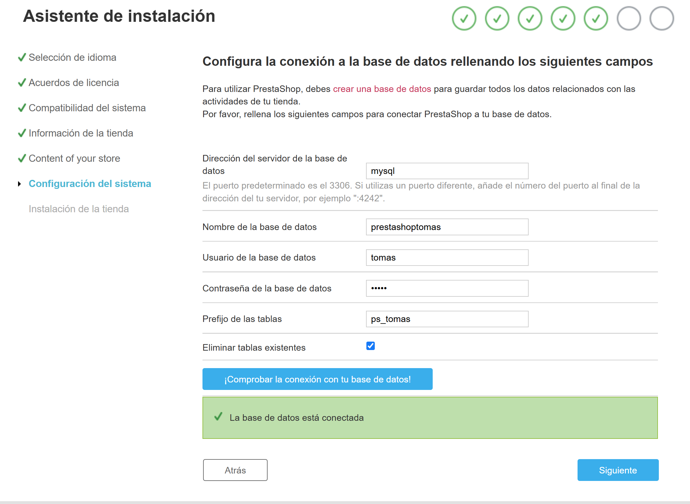
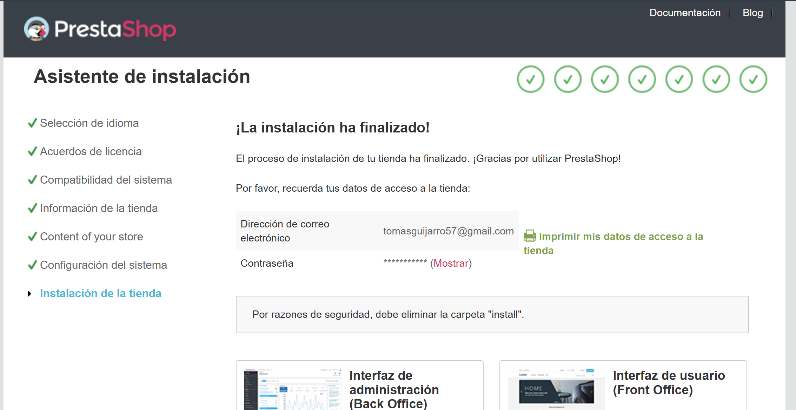
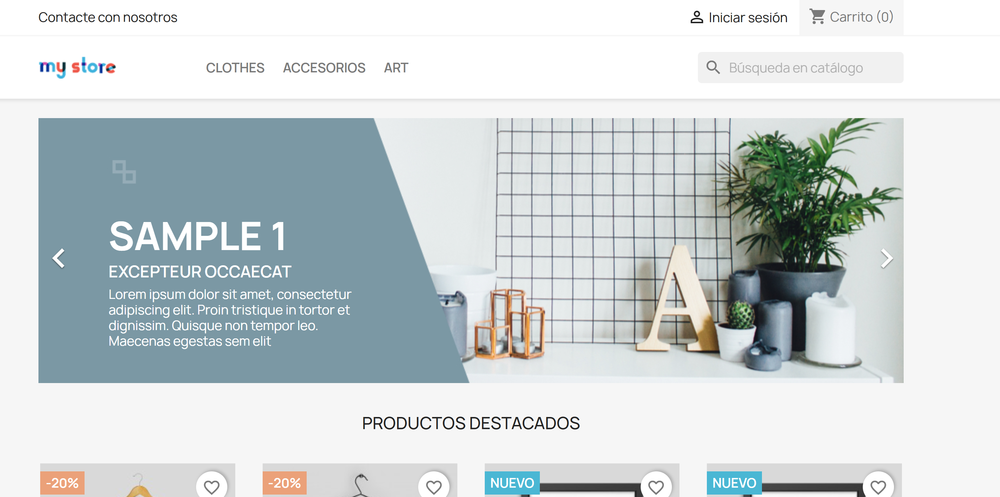
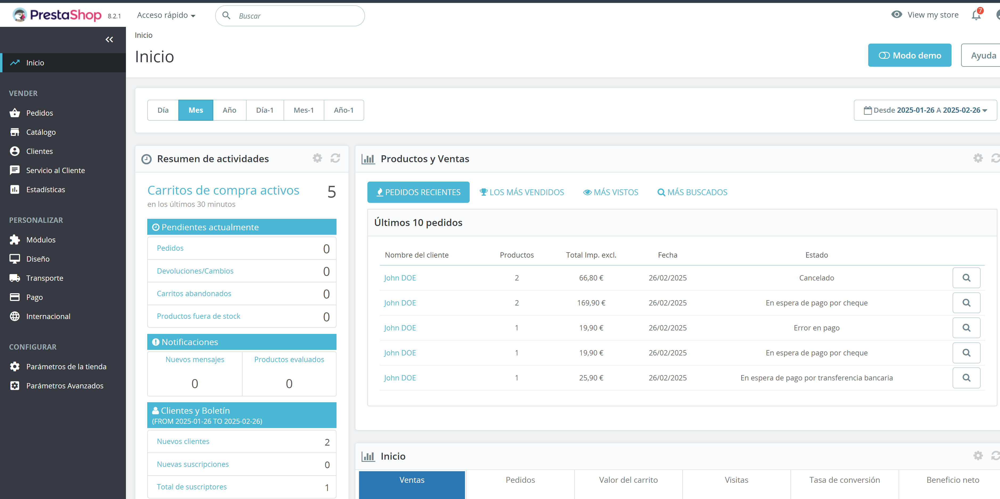

# Practica5.1
En esta practica vamos a utilizar docker y docker compose para habilitar un protocolo https en prestashop y se ejecutara sobre los contenedores de docker.
Para ello primero tendremos que tener una maquina con minimo 20 de espacio

## Variables
Necesitaremos nuestro archivo con variables .env que utilizaremos para asginar las variables que vamos a utilizar

Tambien necesitaremos tener un dominio ip :


## Instalacion de docker

Primero tendremos que instalar docker y docker compose para realizar todas las instalaciones que vayamos a hacer .

```bash
apt install -y docker-ce docker-ce-cli containerd.io docker-compose-plugin
```
Una vez instalado vamos a proceder a configurar un yml con toda la instalacion de la practica.

## Docker compose para instalar prestashop con HTTPS
A continuacion instalaremos los diferentes servicios que serian mysql , prestashop , phpmyadmin y el https con lets encrypt.

```YML
version: '3.4'

services:
  mysql:
    image: mysql:9.1
    ports: 
      - 3306:3306
    environment: 
      - MYSQL_ROOT_PASSWORD=${MYSQL_ROOT_PASSWORD}
      - MYSQL_DATABASE=${MYSQL_DATABASE}
      - MYSQL_USER=${MYSQL_USER}
      - MYSQL_PASSWORD=${MYSQL_PASSWORD}
    volumes: 
      - mysql_data:/var/lib/mysql
    networks: 
      - backend-network
    restart: always
  
  phpmyadmin:
    image: phpmyadmin:5.2.1
    ports:
      - 8080:80
    environment: 
      - PMA_ARBITRARY=1
    networks: 
      - backend-network
      - frontend-network
    restart: always
    depends_on: 
      - mysql

  prestashop:
    image: prestashop/prestashop:8
    environment: 
      - DB_SERVER=mysql
    volumes:
      - prestashop_data:/var/www/html
    networks: 
      - backend-network
      - frontend-network
    restart: always
    depends_on: 
      - mysql

  https-portal:
    image: steveltn/https-portal:1
    ports:
      - 80:80
      - 443:443
    restart: always
    environment:
      DOMAINS: "${DOMAIN} -> http://prestashop:80"
      STAGE: 'production' # Don't use production until staging works
      # FORCE_RENEW: 'true'
    networks:
      - frontend-network
volumes:
  mysql_data:
  prestashop_data:
networks: 
  backend-network:
  frontend-network:
```


## Comprobaciones
Podemos ver que se ejecuta correctamente y se crean los contenedores correspondientes.


Una vez ejecutado el docker compose accedemos a traves de la paina web y podemos ver que se accede correctamente.



Una vez que accedemos configuramos para comprobar que la base de datos funciona correctamente y siguiente



Se crea y se instala el prestashop correctamente



Y accedemos a la tienda para comprobar que funciona tambien



Borramos la carpeta install para poder acceder a la seccion de administrar tienda y como podemos comprobar funciona correctamente



Con esto dariamos por terminada la practica.
